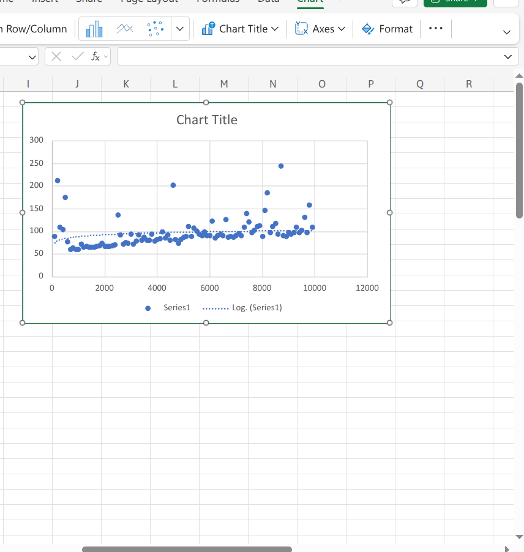

Starting repository for `Data Structures` COMP20280 2025-2026
lab1:
Q5: Yes all test passes.

Q6: A SinglyLinkedList has a null pointer after the last node meaning it has an end and a beginning whereas a CircularLinkedList much like a circle has no beginning and no end.

Q7: In what situations would you prefer to use a linked list to an array? 

it's easier to insert and remove elements without relocating and reorgansing the entire structure.

Q8: Describe 2 possible use-cases for a circularly linked list (2-3 sentences for each). 

1: photo gallery: When you are swiping through photos, after you reach the very last image, the next swipe often brings you right back to the first photo. this  is an example of circularly linked list usage.

2: The Clock: A clock is a physical circularly linked list of numbers. When the second hand reaches 60, it doesn't hit a null wall or stop, it simply rotates back to 1. This continuous loop allows the system to track infinite time using a finite set of nodes (1 through 12).

lab2:
Q2: Write the pseudocode for an algorithm which implements a Queue using two stacks.
Provide implementations for the enqueue() and dequeue() methods.

Algorithm enqueue(e):
if stack2 is empty:
    while stack1 is not empty:
        stack2.push(stack1.pop())
        stack1.add(e)

Algorithm dequeue(e):
if stack2 is empty: 
   while stack1 is not empty:
       stack2.push(stack1.pop())

if stack2 is empty:
    return error "Queue Underflow"
        return stack2.pop()

Q3:
Write the pseudocode algorithm which reverses the elements on a Stack using two additional Stack's (no other data structures are allowed).

Algorithm reverse:
while stack1 is not empty:
    stack2.push(stack1.pop())

while stack2 is not empty:
    stack3.push(stack2.pop())

while stack3 is not empty:
    stack1.push(stack3.pop())

lab3: 
Q2

Function countExternal(T,p):

Takes in T and p(node) t being the tree itself we don't need it in the code implementation as its written inside the class.
ifT.isExternal(p)
Return 1;
else
Int count = 0;
if(T.left(p) != null) then
count = count + countExternal(T, T.left(p))
if(T.right(p) != null) then
Count = count + countExternal(T, T.right(p))
Return count

Q3

countLeftExternal(p):

if(p == null) then
Return 0;
else
Int count = 0;
if(left(p) != null): then
if(isExternal(left(p)) then
count++;
else
Count = count + countLeftExternal(left(p))

if(right(p) != null)
count = count + countLeftExternal(right(p));
return count

Q5 

countDescendents(p)

if(isExternal(p)) then
Return 0
Count = numChildren(p)
For each child c in numChildren(p) do
Count += countDescendandants(c)
Return count

lab4:

Q5 diameter pseudocode:

Algorithm findDiameter(p):
if p is null:
    return 0

//Get the diameter of each subtree
leftHeight = height_recursive(left(p))
rightHeight = height_recursive(right(p))

// Get the diameter of each subtree recursively
leftDiameter = findDiameter(left(p))
rightDiameter = findDiameter(right(p))

return max(leftHeight + rightHeight + 3, max(leftDiameter, rightDiameter))

lab 5:
Q5)

a) Binary format from decimal conversion

b) 2468 = 100110100100.

Q6)
a)

Algorithm printReverse(node):
    if node is null
     return
    printReverse(node.next)
    print node.value

Q7)

a)

Algorithm copyRecursive(node):
if node is null:
return null
    newNode = create Node(node.element)
    newNode.next = copyRecursive(node.next)

return newNode

Q10)

